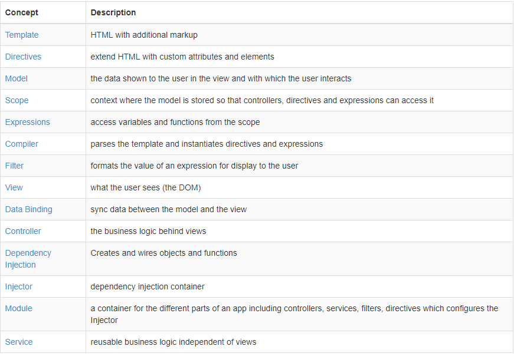

# 基本概念 
[本篇網址](https://docs.angularjs.org/guide/concepts)

## 計算器例子
```html
<div ng-app ng-init='qty=1;cost=2'>
    <b>Invoice:</b>
    <div>
        Quantity:<input type="number" min='0' ng-model='qty'>
    </div>
    <div>
        Cost:<input type="number" min="0" ng-model='cost'>
    </div>
    <div>
        <b>Total:</b>{{ qty*cost|currency }}
    </div>
</div>
```
### 解釋：
- 在AngularJS中,這樣一個element稱之為`template`,當運行AngularJS時,`compiler`處理擁有這些`特殊標籤`的`template`,其中的數值稱為`model`,渲染後即稱為`view`。

- `directives`(指令):用以對Html展現特定的`功能`,如上例,`ng-app`會初始化該區域的Angular功能,`ng-model`則會自動`儲存/更新`元素的`值`
- `{{expression|filter}}`:當compiler遇到此類`markup`,會運算expression並返回值(語法類似javascript),如上例即會在`scope`中取出`ng-model='qty'`與`ng-model='cost'`的值相乘,並照`|`後方的格式輸出(此例為貨幣)
***
## `Controller`
- html頁面
```html
<div ng-app='invoice1' ng-controller='InvoiceController as invoice'>
    <b>Invoice:</b>
    <div>
        Quantity:<input type="number" min="0" ng-model='invoice.qty' required>
    </div>
    <div>
        Cost:<input type="number" min="0" ng-model='invoice.cost' required>
        <select ng-model='invoice.inCurr'>
            <option ng-repeat='c in invoice.currencies'>{{ c }}</option>
        </select>
    </div>
    <div>
        <b>Total:</b>
        <span ng-repeat='c in invoice.currencies'>
            {{ invoice.total(c)|currency:c }}
        </span>
        <button class="btn" ng-click='invoice.pay()'>Pay</button>
    </div>
</div>
```
- javaScript檔
```js
angular.module('invoice1',[])
    .controller('InvoiceController',function InvoiceController(){
        this.qty=1;
        this.cost=2;
        this.inCrr='EUR';
        this.currencies=['USD','EUR','CNY'];
        this.usdToForeignRates={
            USD:1,
            EUR:0.74,
            CNY:6.09
        };
        this.total=function total(outCurr){
            return this.convertCurrenct(this.qty*this.cost,this.inCurr,outCurr)
        }
        this.convertCurrenct=function convertCurrenct(amount,inCurr,outCurr){
            return amount*this.usdToForeignRates[outCurr]/this.usdToForeignRates[inCurr]
        }
        this.pay=function pay(){
            window.alert('Thanks!')
        }
    })    
```
### 解釋
- 新增了js檔用以產生controller實體,用以處理變數以及方法,提供給`expressions`與`directives`
- `ng-controller`:此directive告訴AngularJS-`InvoiceController`會提供給此element與其子,`InvoiceController as invoice`告訴AngularJS會將此`controller`儲存至變數`invoice`於此`scope`
- 輸出與改變model數值的方法改透過前餟詞`invoice.`,透過`ng-repeat`迴圈輸出,`{{invoice.total(...)}}`則能呼叫controller方法並輸出結果


***
## Move business logic from controller to `services`
- 當程式碼增加時,將`business logic`從`controller`分離至`services`是洽當的作法,如此一來,該business logic則能夠重複使用
- html
```html
<div ng-app='invoice2' ng-controller='InvoiceController as invoice'>
    <b>Invoice:</b>
    <div>
        Quantity:<input type="number" min='0' ng-model='invoice.qty' required>
    </div>
    <div>
        Cost:<input type="number" min="0" ng-model='invoice.cost' required>
        <select ng-model='c in invoice.currencies'>
            <option ng-repeat='c in invoice.currencies'>{{ c }}</option>
        </select>
    </div>
    <b>Total:</b>
    <span ng-repeat='c in invoice.currencies'>
        {{invoice.total(c) | currency:c}}
    </span><br>
    <button class="btn" ng-click='invoice.pay()'>Pay</button>
</div>
```
- controller(invoice2.js)
```js
 angular.module('invoice2',['finance2'])
    .controller('InvoiceController',['currencyConverter',function InvoiceController(currencyConverter){
        this.qty=1;
        this.cost=2;
        this.inCurr='EUR';
        this.currencies=currencyConverter.currencies;

        this.total=function total(outCurr){
            return currencyConverter.convert(this.qty*this.cost,this.inCurr,outCurr);
        }
        this.pay=function pay(){
            window.alert('Thanks!')
        }
    }])
```
- services(finance2.js)
```js
 angular.module('finance2',[])
    .factory('currencyConverter',function(){
        var currencies=['USD','EUR','CNY'];
        var usdToForeignRates={
            USD:1,
            EUR:0.74,
            CNY:6.09
        }
        var convert=function(amount,inCurr,outCurr){
            return amount*usdToForeignRates[outCurr]/usdToForeignRates[inCurr];
        }

        return {
            currencies:currencies,
            convert:convert
        };
    })
```
### 解釋:
- 將`convertCurrency`方法移動到`finance2.js`中
- `Dependency Injection(DI)`:在Angular中,所有實體(directives,filters,controllers,services...)皆透過DI建立,其容器稱為`injector`(注入者)
- 放置所有工作物件者,在Angular中稱之為`module`,當Angular運行時,會透過`ng-app`啟動module,如上例中的`ng-app='invoice2'`
- 當Angular讀取到`ng-app='invoice2'`時,會建invoice2 module,`angular.module('invoice2',['finance2'])`表明invoice2`相依於finance2`,據此Angular運作InvoiceController以及currenctConverter
- Angular可以透過多種方法建立Service([Service指南](https://docs.angularjs.org/guide/services)),此例為藉由`anonymous factory方法`建立,此方法必須回傳`currenctConverter`實體
- Angular透過定義`函數參數`達到相依性注入,此例中InvoiceController方法有函數currencyConverter,Angualr藉此得知二者相依關係,並呼叫此方法傳入Service實體
- .controller()內第二參數為一陣列,此陣列第一元素為相依Service的名稱,第二元素為controller建構函式


***
## 從遠端取得資料
- html
```html
<div ng-app='invoice3' ng-controller='InvoiceController as invoice'>
    <b>Invoice:</b>
    <div>
        Quantity:<input type="number" min='0' ng-model='invoice.qty' required>
    </div>
    <div>
        Cost:<input type='number' min="0" ng-model='invoice.cost' required>
        <select ng-model='invoice.inCurr'>
            <option ng-repeat='c in invoice.currencies'>{{c}}</option>
        </select>
    </div>
    <div>
        <b>Total:</b>
        <span ng-repeat='c in invoice.currencies'>
            {{invoice.total(c)|currency:c}}
        </span><br>
        <button class="btn" ng-click='invoice.pay()'>Pay</button>
    </div>
</div>
```
- controller
```js
angular.module('invoice3',['finance3'])
    .controller('InvoiceController',['currencyConverter',function InvoiceController(currencyConverter){
        this.qty=1;
        this.cost=2;
        this.inCurr='EUR';
        this.currencies=currencyConverter.currencies;

        this.total=function(outCurr){
            return currencyConverter.convert(this.qty*this.cost,this.inCrr,outCurr)
        }
        this.pay=function pay(){
            window.alert('Thanks!');
        }
    }])
```
- service
```js
 angular.module('finance3',[])
    .factory('currencyConverter',['$http',function($http){
        var currencies=['USD','EUR','CNY']
        var usdToForeignRates={};

        var convert=function(amount,inCurr,outCurr){
            return amount*usdToForeignRates[outCurr]/usdToForeignRates[inCurr];
        };

        var refresh=function(){
            var url=`https://api.exchangeratesapi.io/latest?base=USD&symbols=${currencies.join(',')}`;
            return $http.get(url).then(function(response){
                usdToForeignRates=response.data.rates;
                usdToForeignRates['USD']=1;
            });
        };

        refresh();

        return{
            currencies:currencies,
            convert:convert
        };
    }])
```