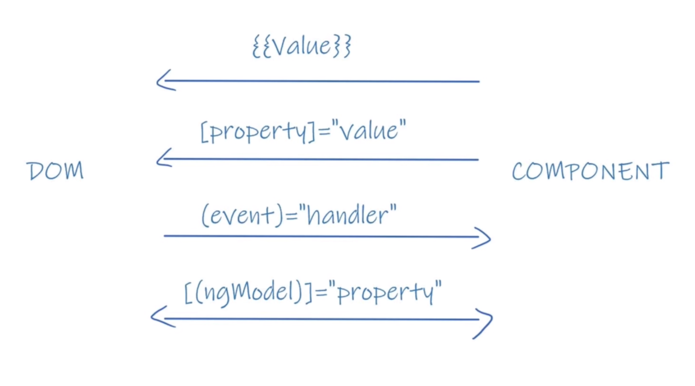

# 什麼是Angular
1. Angular是一套Web前端開發框架(Framework)
2. 它由`Html`+`css`+`TypeScript`組成
3. 特點為`模塊化(Module)`與`組建化(Component)`
4. 她把網頁元素切割為一個個組件,需要時引入,替換
***
## Say No to jQuery
1. Angular與jQuery`並不兼容`,且二者思路`完全相反`
2. jQuery需要操作`DOM`,Angular`不需要`
   - jQuery操作DOM案例
   - 當專案逐漸龐大時,過於龐雜的操作會帶來維護與渲染的困擾
```js
$('#button').click(function(){
    $('#p').html('...')
})
```
3. Ａngular提供一套數據綁定機制避免上述麻煩

    - 不需花時間獲取即操作DOM
***
