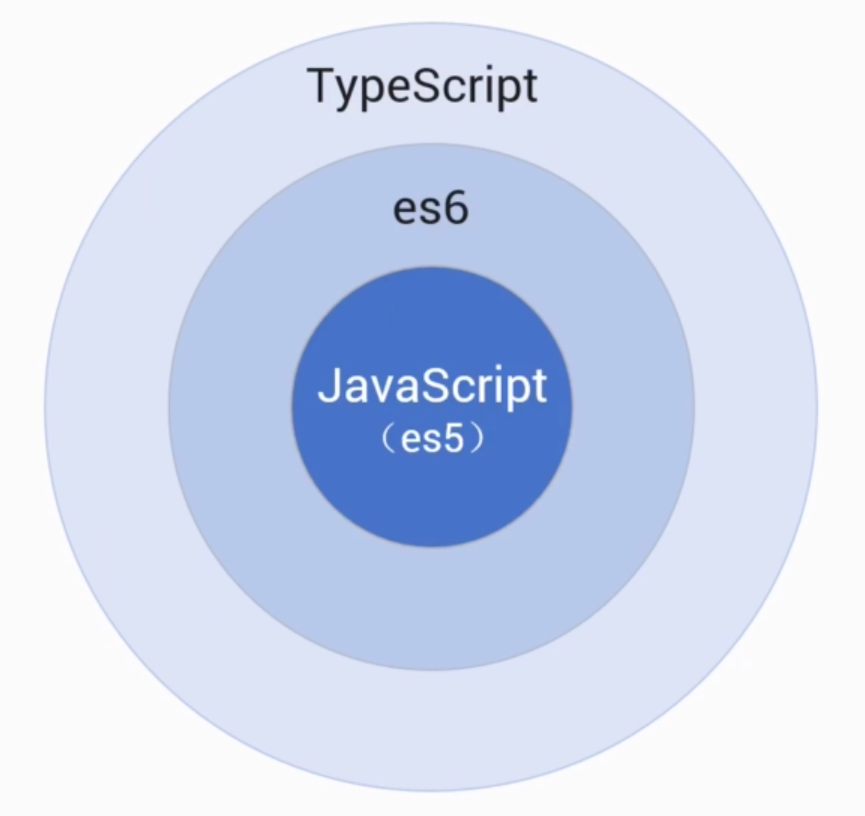
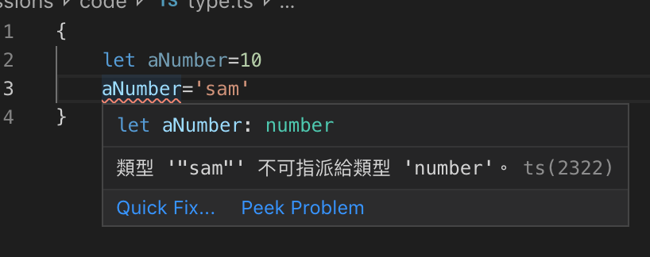

# TypeScript
1. A]ngular採用`TypeScript`
2. 其與javaScript關係如下
   
   - 瀏覽器並不認識TypeScript
   - Angular會自動將其轉譯為javaScript
3. 開始使用Angular前需安裝TypeScript
   - `npm i typescript -g`安裝
***
## `let` and `const` vs `var`
1. var的缺陷:
   1. 其他作用域會改變值
   2. let指派值只作用於其區域
        ```js
        var a=1
        {
            var a='test'
        }
        console.log(a);
        //輸出test
        var b=2
        {
            let b='sam'
        }
        console.log(b)
        //輸出2
        ```
2. 定義不被修改的常數:
   ```js
   const pi=3.1415926
   pi=123
   ```
   執行時會報錯
***
## 靜態類型檢查
1. javaScript是`弱型別語言`
2. TypeScript加入了`型別檢查`
   1. 在`.ts`(TypeScript)檔案中變數一經指派便具有型別,不允許指派其他型別的值
   
3. 定義方法
    1. 當型別為`any`時才能自由賦值
    ```ts
    {
        let anyType:any;
        anyType=1;
        anyType='hello';


        let bool:boolean=true;

        let str:string='str';

        let numArr:number[]=[1,2,3];
        
        let anyArr:any[]=['a',1,true];
    }
    ```