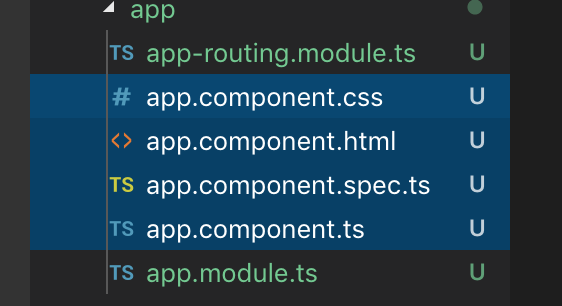

# 組件/模塊化
1. 在Angular中,以下部分組成組件



如上圖,`app.component`為前綴的檔案構成`app`組件,包含四部分
1. `css`-組件樣式
2. `html`-組件結構
3. `spec.ts`-測試元件
4. `ts`-組件的js邏輯
***
## 元件ts說明
```ts
import { Component } from '@angular/core';
//裝飾器
@Component({
  //至主頁面尋找<app-root></app-root>標籤
  selector: 'app-root',
  //創建templateUrl指定的頁面實例並插入selector標籤中
  templateUrl: './app.component.html',
  //本組建css樣式
  styleUrls: ['./app.component.css']
})
export class AppComponent {
  //組件的所有數據皆作為此class的屬性儲存在此
  //若該元件有title屬性,會帶入此處所賦予的值
  title = 'Angular';
}
```
***
## 元件html說明
```html
<div style="text-align:center">
  <h1>
    <!--在ts檔中設定了title值為Angular,會渲染至此-->
    Welcome to {{ title }}!
  </h1>
</div>
<h2>Here are some links to help you start: </h2>
<router-outlet></router-outlet>
```
***
## 元件css說明
在Angular中組建的樣式相互獨立,互不干擾
```css
h1{
    color: green;
}
```
***
## 主要html
透過Angular啟動的網頁會將相應的元件建立並渲染至html中
```html
<!doctype html>
<html lang="en">
<head>
    <meta charset="utf-8">
    <title>Demo</title>
    <base href="/">

    <meta name="viewport" content="width=device-width, initial-scale=1">
    <link rel="icon" type="image/x-icon" href="favicon.ico">
</head>
<body>
    <!--元件會渲染至此-->
    <app-root></app-root>
</body>
</html>

```
