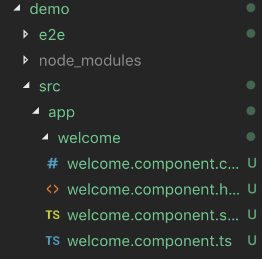

# 建立組件
1. 輸入`ng g(generate) c(component) 組件名稱`-在project/src/app下建立一個包含該組件的資料夾


2. 同時會更新app.module.ts
```ts
import { BrowserModule } from '@angular/platform-browser';
import { NgModule } from '@angular/core';

import { AppRoutingModule } from './app-routing.module';
import { AppComponent } from './app.component';
//import了剛創建的元件
import { WelcomeComponent } from './welcome/welcome.component';

@NgModule({
//用戶建立的組件透過declarations引入
  declarations: [
    AppComponent,
    //自動引入剛創建的元件
    WelcomeComponent
  ],
  //內建元件/第三方套件則透過imports引入
  imports: [
    BrowserModule,
    AppRoutingModule
  ],
  providers: [],
  bootstrap: [AppComponent]
})
export class AppModule { }
```