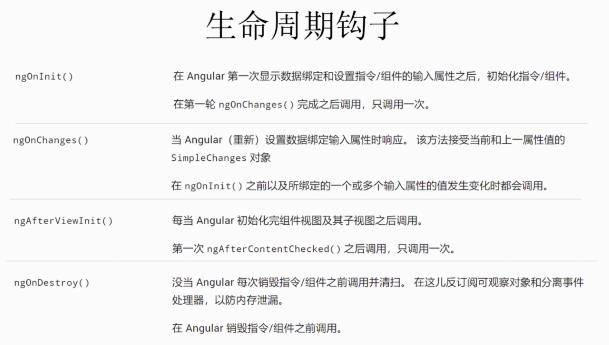

# Angular生命週期鉤子
1. 代表組件不同時期的各種狀態從創建到渲染,再而檢察屬性變化,終於摧毀
2. 鉤子?
   1. 他會在各階段觸發對應`函式`
   2. 透過定義`Angular core`庫中的生命週期鉤子`介面`,可介入該時刻
   3. 每個介面都有`唯一`的函式,為介面名前綴`ng`,如`ngOnInit`
    ```ts
    //此處自angular/core引入OnInit介面
    import { Component, OnInit } from '@angular/core';

    @Component({
        selector: 'app-welcome',
        templateUrl: './welcome.component.html',
        styleUrls: ['./welcome.component.css']
    })
    //宣告實作onInit
    export class WelcomeComponent implements OnInit {

        private title:string;

        constructor() { 
            this.title='Welcome!'
        }
        //實作該介面ngOnInit方法
        ngOnInit() {
        }
    }
    ```
3. 常用鉤子
    