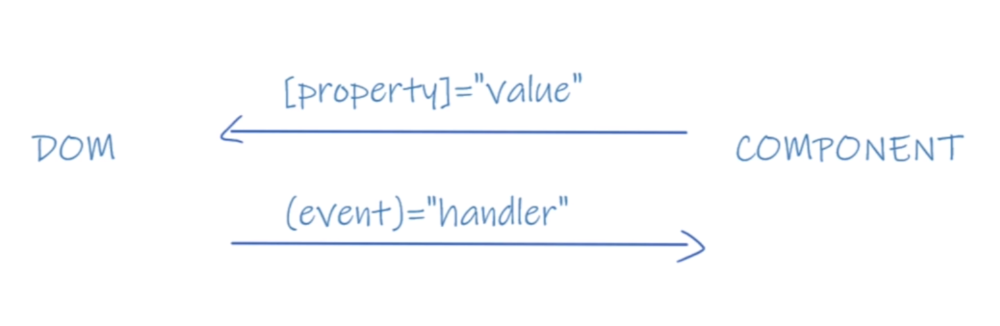

# 雙向綁定
1. Angular透過`[()]`進行`雙向綁定`
2. 等於屬性綁定+事件綁定
3. `[]`屬性綁定建立了`數據`對`視圖`的映射(component對Dom),當component數據改變時,Dom中的元素隨之改變
4. `()`事件綁定建立了`視圖`對`數據`的映射(Dom對component),當Dom數據改變時,component數據隨之改變


示範如下
```ts
import { Component, OnInit } from '@angular/core';

@Component({
  selector: 'app-two-way-binding',
  template: `
  <input [value]="val" type="text"/>
  <input #input (keyup.enter)="onKeyup(input.value)" type="text"/>
  `,
  styleUrls: ['./two-way-binding.component.css']
})
export class TwoWayBindingComponent implements OnInit {
  val='hello'
  others='';

  onKeyup(value:string){
    this.others=value;
    alert(this.others)
  }

  constructor() { }

  ngOnInit() {
  }

}
```
## 說明
1. `#input`為`模板引用變數`,代指所在的Dom,此例中傳遞給後方的`onKeyup()`事件
***
## 合併屬性與事件綁定
1. 要使用`[()]`需先引入FormsModule至`app.module.ts`中
```ts
import { BrowserModule } from '@angular/platform-browser';
import { NgModule } from '@angular/core';
//於此處import
import { FormsModule } from '@angular/forms';

@NgModule({
  declarations: [
    AppComponent
  ],
  imports: [
    BrowserModule,
    AppRoutingModule,
    //原生module需宣告至imports中
    FormsModule
  ],
  providers: [],
  bootstrap: [AppComponent]
})
export class AppModule { }
```
2. 透過`[()]`雙向綁定
```ts
import { Component, OnInit } from '@angular/core';

@Component({
  selector: 'app-two-way-binding2',
  template: `
  <input [(ngModel)]="val" type="text"/>
  `,
  styleUrls: ['./two-way-binding2.component.css']
})
export class TwoWayBinding2Component implements OnInit {
  val='hello'
  constructor() { }

  ngOnInit() {
  }

}
```
## 說明
1. 透過`[(ngModel)]="val"`,該input的Dom數值改變會同步到component中,同時該Dom的數值也隨著component屬性變化而變化,此即為`雙向綁定`