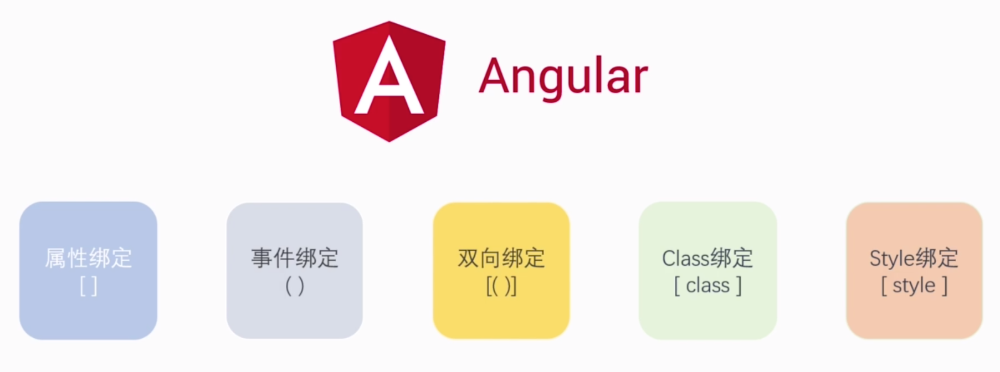

# 組件間溝通

## 父子傳遞
1. 父傳子-`@Input()`
   1. 首先,在父component中定義要傳給子component的屬性與值
   ```ts
   import { Component, OnInit } from '@angular/core';

    @Component({
        selector: 'app-parent',
        templateUrl: './parent.component.html',
        styleUrls: ['./parent.component.css']
    })
    export class ParentComponent implements OnInit {
        border='1px solid red';
        //在此定義
        data='passToChild';
        constructor() { }

        ngOnInit() {
        }

    }
   ```
   2. 在父模板中透過`[自訂變數名]=父component屬性名`傳遞給子component
   ```html
   <div [style.border]='border'>
       <p>parent works!</p>
       <!--在此傳遞-->
       <app-child [source]='data'></app-child>
    </div>
   ```
   3. 在子component中透過`@Input(自訂變數名)`取得父component傳遞資料
   ```ts
   //注意此處會import Input
   import { Component, OnInit, Input } from '@angular/core';

    @Component({
        selector: 'app-child',
        templateUrl: './child.component.html',
        styleUrls: ['./child.component.css']
    })
    export class ChildComponent implements OnInit {
        //於此處取值
        @Input('source')source:any
        constructor() { }

        ngOnInit() {
        }

    }

   ```
   4. 子模板渲染該值
   ```html
   <p>child works!</p>
   <p>Got data from parent: {{source}}</p>
   ```
2. 子傳父-`@Output`
   1. 父模板中為子模板定義`(change)`事件,子component依據名稱叫用其指定的方法
   ```html
   <div [style.border]='border'>
       <p>parent works!</p>
       <app-child [source]='data' (change)='change()'></app-child>
    </div>
   ```
   2. 在父component中定義`change`事件,子component會觸發之
   ```ts
   import { Component, OnInit } from '@angular/core';
   @Component({
       selector: 'app-parent',
       templateUrl: './parent.component.html',
       styleUrls: ['./parent.component.css']
    })
    export class ParentComponent implements OnInit {
        border='1px solid red';
        data='passToChild';
        change(){
            alert('change')
        }
        constructor() { }

        ngOnInit() {
        }
    }
   ```
   3. 在子模板中叫用`onClick`觸發`@Output`定義的事件觸發器
   ```html
   <p>child works!</p>
   <p (click)='onClick()'>Got data from parent: {{source}}</p>
   ```
   4. 在子component中透過`@Output`定要要傳給父的物件
   ```ts
   //此處import EventEmitter
   import { Component, OnInit, Input, Output,EventEmitter } from '@angular/core';
   @Component({
       selector: 'app-child',
       templateUrl: './child.component.html',
       styleUrls: ['./child.component.css']
    })
    export class ChildComponent implements OnInit {
        @Input('source')source:any
        //此處定義傳給父的是一事件觸發器
        @Output() change=new EventEmitter();
        onClick(){
            this.change.emit();
        }
        constructor() { }

        ngOnInit() {
        }

    }
   ```
***