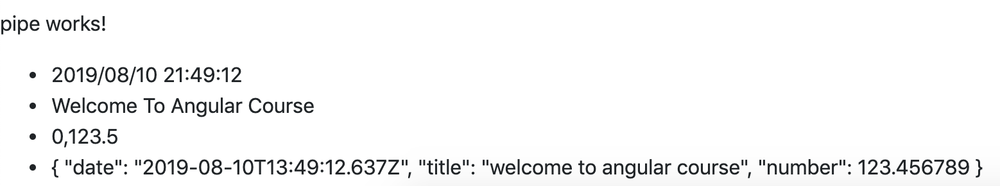

# pipe
1. 用以`格式化`數據
2. 包括日期,文字大小寫,小數,Json等
3. 於template透過`|類型:格式`完成

示範
1. 於component定義數據
```ts
import { Component, OnInit } from '@angular/core';

@Component({
    selector: 'app-pipe',
    templateUrl: './pipe.component.html',
    styleUrls: ['./pipe.component.css']
})
export class PipeComponent implements OnInit {
    example={
        date:new Date(),
        title:'welcome to angular course',
        number:123.456789
    }
    constructor() { }

    ngOnInit() {
    }
}
```
2. 於template中透過`{{ 屬性名 | 類型:格式}}`格式化數據
```html
<p>pipe works!</p>
<ul>
    <li>{{example.date | date:'yyyy/MM/dd HH:mm:ss'}}</li>
    <li>{{example.title | titlecase}}</li>
    <li>{{example.number | number:'4.1-1'}}</li>
    <li>{{example | json}}</li>
</ul>
```
3. 輸出
