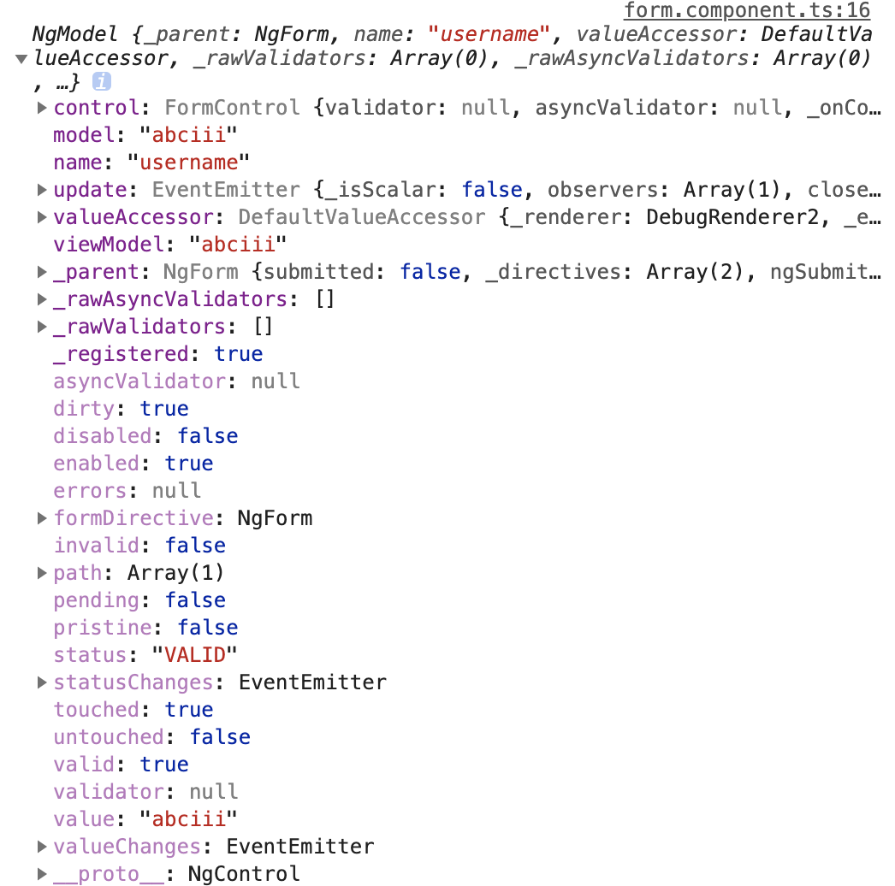

# Forms
## 兩種表單
1. 模板(template)驅動(簡易表單)
   1. template驅動
   2. 雙向綁動
   3. 同步更新數據
2. 響應式(複雜表單)
   1. 數據模型驅動
   2. 更新數據模型控制/驗證數據
***
## 模板(template)表單
1. 在template中透過`ngForm`建立表單,他會使表單input能夠捕捉值內容加以驗證
2. 透過`[(ngModel)]`進行表單值得雙向綁定
3. 將`ngModel`的賦值給`#username`
4. 將`#username`傳遞給`(change)`事件,如此便得以驗證該值
```html
<p>form works!</p>
<!--模板驅動表單-->
<form ngForm>
    <div class="form-group">
        <label for="username">username</label>
        <input #username='ngModel' (change)='onChange(username)' name="username" [(ngModel)]='form.username' type="text" class="form-control" id="username">
    </div>
    <div class="form-group">
        <label for="password">password</label>
        <input name="password" [(ngModel)]='form.password' type="password" class="form-control" id="password">
    </div>
    <button type="submit" class="btn btn-primary">submit</button>
</form>
```
```ts
import { Component, OnInit } from '@angular/core';

@Component({
    selector: 'app-form',
    templateUrl: './form.component.html',
    styleUrls: ['./form.component.css']
})
export class FormComponent implements OnInit {
    //建立表單初始值
    form={
        username:'',
        password:''
    }
    //onChange事件捕捉表單值得變化,x參數可用以驗證
    onChange(x){
        console.log(x)
    }
    constructor() { }

    ngOnInit() {
    }
}
```
控制台輸出


1. dirty:是否修改過
2. errors:錯誤
3. invalid:是否不符驗證
4. status:驗證狀態
5. touched:是否聚焦過
6. untouched:是否未被聚焦
7. valid:是否符合驗證
8. value:表單值