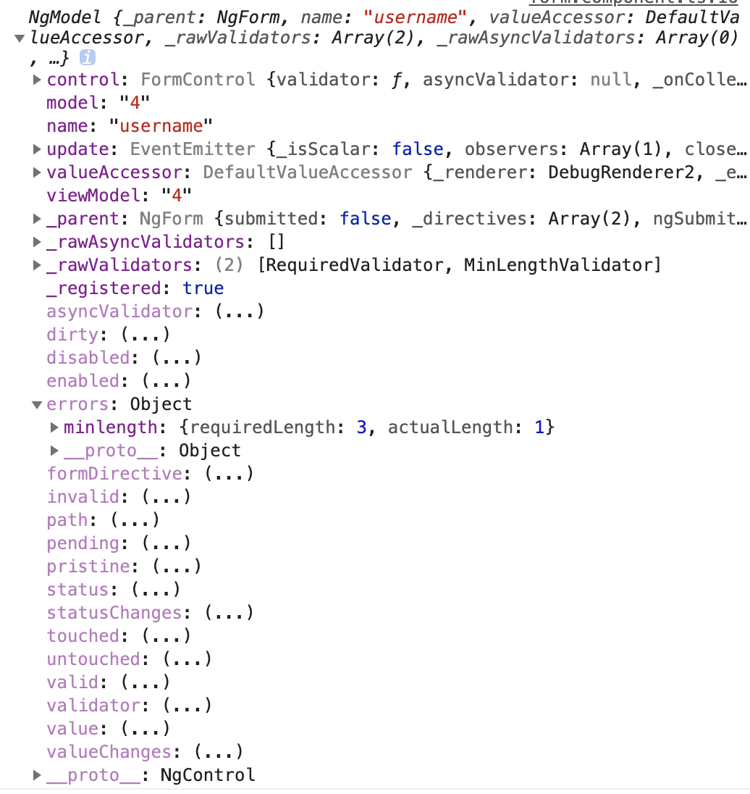

# 驗證Form
1. input本是自帶許多驗證,如`required`,`minlength`等
2. `ngForm`會提供`ngModel`值更多的驗證屬性,用以搭配`*ngIf`等
   1. `touched`-是否聚焦過
   2. `invalid`-是否符合驗證
   3. `.errors`-可取得驗證失敗訊息
      1. `errors.required`-表示不符合"必須"驗證
      2. `errors.minlength`-表示不符合"最小長度"驗證

示範如下
```html
<p>form works!</p>
<!--模板驅動表單-->
<form ngForm>
    <div class="form-group">
        <label for="username">username</label>
        <input minlength="3" required #username='ngModel' (change)='onChange(username)' name="username" [(ngModel)]='form.username' type="text" class="form-control" id="username">
        <div *ngIf='username.touched&&username.invalid' class="text-danger">
            <div *ngIf='username.errors.required'>帳號不可為空</div>
            <div *ngIf='username.errors.minlength'>長度不可小於3</div>
        </div>
    </div>
    <div class="form-group">
        <label for="password">password</label>
        <input name="password" [(ngModel)]='form.password' type="password" class="form-control" id="password">
    </div>
    <button type="submit" class="btn btn-primary">submit</button>
</form>
```

控制台輸出
