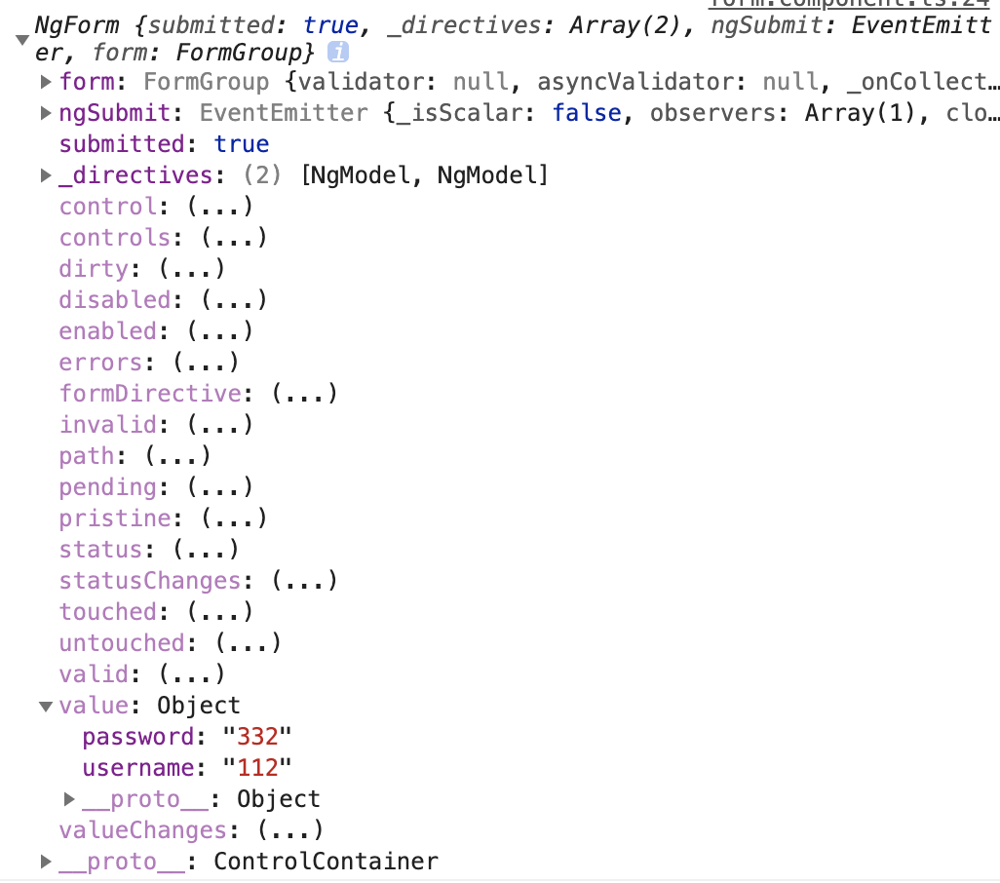

# 提交表單
1. 為提交按鈕/事件設定事件,並透過雙向綁定的model送出表單
   1. template
    ```html
    <button (click)='onSubmit()' type="submit" class="btn btn-primary">submit</button>
    ```
   2. component
    ```ts
    onSubmit(){
        //送出雙向綁定的資料
    }
    ```
2. 將`ngForm`指派給變數,透過Angular提供的`(ngSubmit)`設定提交事件
   1. template
   ```html
   <form #f='ngForm' (ngSubmit)='onNgSubmit(f)'></form>
   ```
   2. component
   ```ts
    onNgSubmit(f){
       //送出ngForm表單
    }
   ```
   3. 注意:ngForm物件不是雙向綁定物件,控制台輸出如下
   
   4. 可以透過`.value`取得要送出的值