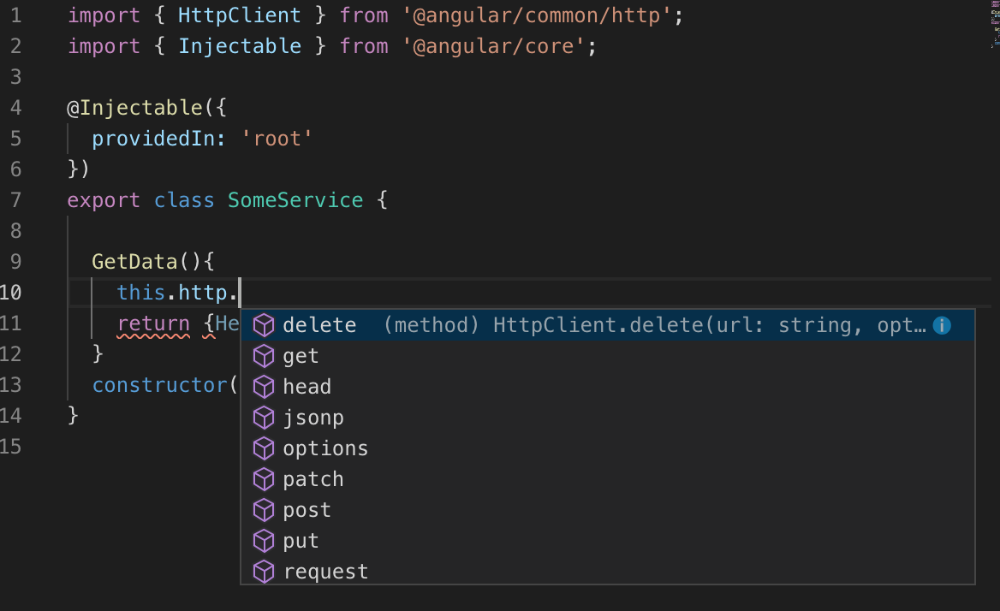
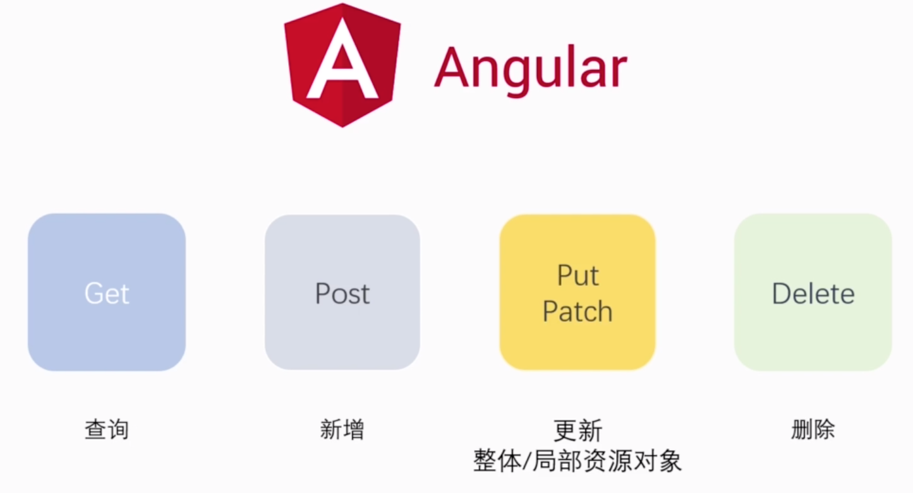

# 建立Http Service
1. 在`app.module.ts`中的imports裡添加`HttpClient`
2. 在CLI輸入`ng g s service名稱`
   1. 這個步驟會在`src/app`下建立`service.ts`與`service.spec.ts`
   2. 在`service.ts`中會在`@Injectable`裝飾器將該service自動註冊到root中
   3. 在service建構式中注入上面import的http服務
   4. 注意要`import { HttpClient } from '@angular/common/http';`
   5. 在自寫的方法中便可使用http服務
   
   6. 其方訪對應如下
   
3. `Promise`與`Observable`
   1. Promise無倫有沒有呼叫`.then()`都會執行
   2. Observable若無呼叫`.subscribe()`不會執行(節省資源)
4. 透過`HttpClient`進行CRUD:
   1. `.get(url)`-用於查詢
   2. `.post(url,{})`-用於新增
   3. `.delete(url/id)`-用於刪除
   4. `.patch(url/id,{})`/`.put(url/id,{})`-用於更新
         1. `.patch()`-更新`部分`資資料
         2. `.put()`-將修改目標`替換`成傳遞的物件